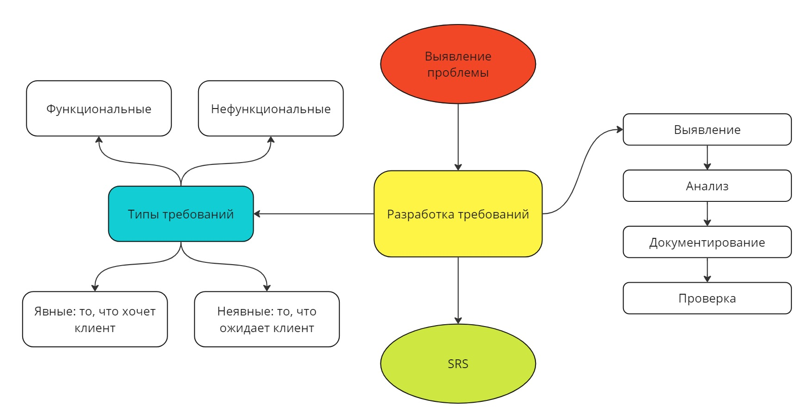

<h1 align="center">Неявные требования в разработке программного обеспечения</h1>

[Что такое неявные требования](#что-такое-неявные-требования)

[Классификация неявных требований](#классификация-неявных-требований)
- [Безопасность](#безопасность)
- [Общедоступность](#общедоступность)
- [Ремонтопригодность](ремонтопригодность)
- [Стабильность](#стабильность)
- [Удобство использования](#удобство-использования)

[Методы обнаружения неявных требований](#методы-обнаружения-неявных-требований) 

[Включение неявных требований в процесс разработки](#включение-неявных-требований-в-процесс-разработки)

[Список неявных требований](#cписок-неявных-требований)

## Что такое неявные требования

Жизненный цикл разработки программного обеспечения обычно начинается со сбора данных о требованиях, за которым следует этап анализа требований, который включает в себя детальное изучение потребностей, которым должно соответствовать программное обеспечение. Часто некоторые данные, связанные с требованиями, плохо документированы, и бремя визуализации таких данных ложится на плечи разработчика. 
> Такие расплывчатые требования часто приводят к тому, что программные решения не полностью удовлетворяют потребности клиентов. Большинство требований, не учтенных изначально, случайно обнаруживаются на этапах принятия пользователями. Клиенты считают, что такие требования были бы автоматически фиксируется программным обеспечением. Трудно определить, кто виноват в том, что не удалось что-либо зафиксировать.

Чтобы избежать подобных инцидентов, приводящих к недовольству клиентов, важно сосредоточиться на идентификации неявных требований. Рисунок дает общее представление о разработке требований в целом:

>*«Представьте себе автомобиль, рекламируемый как « роскошный» , но без кондиционера – неявное ожидание, оставшееся нереализованным».*

**Неявные требования** — это *скрытые* или *предполагаемые* требования, которые не заявлены открыто, но ожидается, что они будут выполнены пользователями. Поскольку они ожидаемы, бизнес-пользователи могут не упоминать их явно на собраниях. Иногда бывает сложно определить область применения, поскольку нет четкой документации или граничных значений.

## Классификация неявных требований

Ниже представлена таксономия данных о неявных требованиях из [авторской статьи](Management_of_IR.pdf). Автор предлагает выделить 5 категорий данных требований, которые часто пропускаются (т.е. остаются неявными). Основными категориями неявных требований являются: безопасность, общедоступность, ремонтопригодность, стабильность и удобство использования. 
- ### Безопасность
  Требования к безопасности могут быть указаны явно, но также могут подразумевать дополнительные требования (которые открыто не заявляются клиентами). Категориями безопасности в исследовании являются: идентификация и аутентификация, доступ, подотчетность и конфиденциальность.
- ### Общедоступность
  Требования к общедоступности (в контексте удобства использования для людей с ограниченными возможностями) представляют собой еще одну категорию требований, которые часто упускаются из виду. Это связано с отсутствием надлежащих методов разработки и авторских инструментов. [Web Content Accessibility Guidelines 2.0](https://www.w3.org/TR/WCAG20/) и [ISO 9241-171:2008](https://www.iso.org/standard/39080.html) руководство по обеспечению доступности программного обеспечения содержит широкий спектр рекомендаций, направленных на то, чтобы сделать Интернет более доступным для людей с ограниченными возможностями. Основными категориями в руководстве по обеспечению доступности являются: воспринимаемость, работоспособность, понятность и надежность. 
- ### Ремонтопригодность
  Требованиях к ремонтопригодности важны при разработке и внедрении программного обеспечения. Таким образом, совершенствование процессов разработки программного обеспечения может повысить удобство сопровождения программного обеспечения. Проблемы во время разработки могут привести к снижению стандартов ремонтопригодности. Ремонтопригодность – способность программного обеспечения к модификации. Удобство обслуживания программного обеспечения имеет 4 основные категории: анализируемость, изменчивость, стабильность и прослеживаемость.
- ### Стабильность
  Требования к стабильности, как правило, не поддерживаются традиционными методами разработки программного обеспечения. Тем не менее, это очень важно, особенно сегодня, когда большое внимание уделяется разработке устойчивых и экологически чистых систем. Устойчивое развитие (стабильность) определяется как удовлетворение потребностей настоящего времени без ущерба для способности будущих поколений удовлетворять свои собственные потребности. Стабильность определяется в соответствии с тремя переменными: время, функция и система. Время - это фактическое количество времени, необходимое для обслуживания или разработки программного обеспечения; функция - это удовлетворение поставленных задач, а система относится к человечеству в его экосистеме. Обратите внимание, что аспект использования системы можно разделить на 5 аспектов устойчивости, а именно: экономический, технический, социальный, индивидуальный и экологический. Эти 5 аспектов служат для выявления различных потенциальных воздействий системы.
- ### Удобство использования
  Требования к удобству использования влияют на разработку программного обеспечения и должны учитываться на этапе разработки требований. Удобство использования является важным требованием, поскольку оно повышает производительность и удовлетворенность клиентов при одновременном снижении затрат на обучение и документацию, как упоминалось в [интересном исследовании](https://www.interaction-design.org/literature/topics/human-computer-interaction). Это исследование направлено на воплощение принципов HCI (взаимодействия человека и компьютера). Автор определяет функциональные возможности юзабилити (FUF) на основе HCI для выработки рекомендаций, которые программное обеспечение должно предоставлять пользователю. Требования к удобству использования связаны с пользовательским интерфейсом программного обеспечения и часто остаются скрытыми в ходе выявления требований. Обнаружено несколько подкатегорий требований к удобству использования, а именно: обратная связь, функции отмены действий, валидации форм или полей, [Wizard требования](https://tproger.ru/articles/kak-slozhnyj-tablichnyj-dizajn-mozhno-zamenit-prostym-wizard-reweniem), пользовательский опыт, различные языки и функции оповещений.
  
## Методы обнаружения неявных требований
Выявление неявных требований может быть сложной, но решающей задачей для успеха проекта. Вот несколько методов, которые помогут их раскрыть:

- **Интервью с заинтересованными сторонами**: участвуйте в тщательном обсуждении с заинтересованными сторонами, чтобы понять их цели, предпочтения и основные предположения. Обратите внимание на то, что они прямо не упоминают, но могут предполагать.
Наблюдение за поведением пользователей: наблюдайте за пользователями в их естественной среде, чтобы понять, как они работают и что они ценят.
- **Тестирование прототипа**: создавайте прототипы продукта и собирайте отзывы пользователей. Их реакции и предложения могут раскрыть скрытые потребности, которые изначально не были очевидны.
- **Исследование рынка**. Изучите конкурентов и аналогичные продукты на рынке, чтобы определить общие характеристики или функции, которые ожидают пользователи. Это может помочь выявить неявные требования, которые являются отраслевыми стандартами.
- **Анализ обратной связи**: анализируйте отзывы о предыдущих проектах или версиях продукта, чтобы выявить повторяющиеся темы или неудовлетворенные потребности. Это может дать представление о неявных требованиях, которые могли быть упущены из виду.
- **Мозговой штурм**: проводите мозговые штурмы для генерации идей и выявления неявных требований.
- **Документация**: последовательно создавайте и обновляйте документацию, собирая информацию из прошлого опыта и досконально понимая требования приложения, предметной области и клиента.

Вот, довольно [хороший обзор](Comparison_of_Various_RE.pdf) с академической точки зрения.

## Включение неявных требований в процесс разработки
Эффективное включение неявных требований в процесс разработки похоже на создание гармоничной мелодии. Это требует тщательной координации и интеграции на каждом этапе разработки программного обеспечения.

- ### Интеграция с дизайном и архитектурой.
Неявные требования должны органично вписываться в дизайн и архитектуру программного обеспечения. Точно так же, как красиво построенное здание сочетает в себе функциональность и эстетику, создавая привлекательное пространство, учет неявных потребностей гарантирует, что программное обеспечение будет интуитивно понятным, визуально привлекательным и будет соответствовать ожиданиям пользователей.
- ### Интеграция с разработкой программного обеспечения
Разработчики могут включать неявные требования в свой процесс разработки, учитывая ожидания пользователей на каждом этапе разработки программного обеспечения.
- ### Интеграция с тестированием и обеспечением качества.
Неявные требования имеют решающее значение на этапе тестирования. Тестирование должно не только проверять явные потребности, но и оценивать, насколько хорошо программное обеспечение соответствует неявным требованиям. Тестируя сценарии, которые покрывают эти скрытые потребности, мы обеспечиваем удобство использования, эффективность и удовлетворенность пользователей. 

## Cписок неявных требований

Ниже представлен список неявных требований от команды разработчиков и UX-дизайнеров по мотивам [данной статьи](https://medium.com/naukri-engineering/beyond-the-surface-implicit-requirements-in-software-development-f4a2b3087f7a).

| **№**  | **Неявное требование**|
| -------| -------------- |
|  1                        |   Ссылки должны открываться в новом окне/ вкладке при нажатии левой кнопкой мыши, если не указано иное.             |
|  2                        |   Навигация с помощью клавиатуры должна работать на слоях/лайтбоксах, а не на фоновом экране.             |
|  3                        |   Всякий раз, когда необходимо открыть слой после нажатия ссылки/вкладки/кнопки, перепроверьте, не открывается ли при этом новое окно. Иногда это происходит в chrome.             |
|  4                        |   Всякий раз, когда слой открывается после нажатия ссылки/вкладки/кнопки, задний экран должен полностью отключаться и становиться серым. Никакая ссылка / вкладка / кнопка не должна работать с этим.          |
|  5                        |   В текстовом поле курсор должен мигать внутри текстового поля при щелчке левой кнопкой мыши.             |
|  6                        |   Текст справки по умолчанию (заполнитель) должен исчезать, когда пользователь начинает печатать.           |
|  7                        |   Текст справки по умолчанию, появляющийся внутри текстовых полей, должен появляться снова, если пользователь выходит из него, ничего не заполняя.             |
|  8                        |   Текст справки по умолчанию не должен приниматься в качестве значения для отправки, т.е. если поле является обязательным и в нем есть только текст справки, то должно быть выдано сообщение об ошибке.             |
|  9                        |   После появления ошибки на странице основное внимание должно быть сосредоточено на первом поле, в котором появилась ошибка.         |
|  10                        |   Логотип компании должен быть интерактивным, если не указано иное.            |
|  11                        |   Раскрывающихся списков окон поддерживают стрелки вверх и вниз, в то время как настраиваемые раскрывающиеся списки также должны поддерживать эту функциональность.             |
|  12                        |   Ширина выпадающего списка должна быть достаточной для размещения самого длинного значения, которое должно быть в нем. В случае, если то же самое невозможно сделать из-за нехватки места, мы должны показать полное значение при наведении курсора мыши.           |
|  13                        |   Если где-либо на сайте есть усеченный текст, то при наведении курсора мыши должен отображаться весь текст целиком (всплывающая подсказка).            |
|  14                        |   Усеченный текст на сайте всегда должен отображаться с многоточием (3 точки ...).           |
|  15                        |   Если в поле "Минимум" введено значение, то значения в поле "Максимум" должны начинаться с поля "Минимум" (условно).             |
|  16                        |   Если в поле есть какая-либо ошибка, то сообщение об ошибке должно начинаться прямо под этим полем. Если пользователь выбирает ключевое слово с помощью подсказчика и нажимает Enter, страница не должна быть отправлена. В поле должно быть введено только выбранное ключевое слово (этот пункт предназначен для выпадающих списков).           |
|  17                        |  Если мы начнем вводить текст или выберем значение из выпадающего списка в поле, в котором с помощью ajax отображалось сообщение об ошибке, то ошибка должна исчезнуть.            |
|  18                        |   Обязательные поля всегда должны обозначаться звездочкой. Если не указано иное.           |
|  19                        |   Во время разбивки на страницы опция "Предыдущая" должна быть доступна только после страницы 1, а опция "Следующая" не должна быть доступна на последней странице.          |
|  20                        |   Если пользователь открывает текст справки на странице, а затем нажимает в любом другом месте на этой странице, текст справки должен закрыться.          |
|  21                        |   Отключенные значения/текст/Выпадающий список должны быть выделены серым цветом.           |
|  22                        |   Копирование и вставка значений в поле пароля или из него не должны быть разрешены.           |
|  23                        |   Информация об авторских правах в нижнем колонтитуле всегда должна содержать текущий год.             |
|  24                        |   Заголовки всех страниц/разделов должны быть оформлены аналогичным образом и иметь одинаковый тип/размер шрифта. Например, на странице сведений о работе можно найти описание работы, профиль желаемого кандидата и компании. Все заголовки одинаковы, и, следовательно, расстояние между ними и внешний вид должны быть одинаковыми.           |
|  25                        |   Пустые места/новые строки без текста должны быть обрезаны в начале и в конце любого текстового поля (кроме экрана входа в систему и поля ввода пароля).           |
|  26                        |   Пользователям не должно быть разрешено вставлять скопированный идентификатор электронной почты в поле Подтверждения идентификатора электронной почты.           |
|  27                        |   Флажок, используемый для определения правил и условий, по умолчанию должен быть снят, если не указано иное.            |
|  28                        |   Я в случае появления сообщения об ошибке. Поле, отображающее ошибку, должно быть выделено, как только пользователь внесет изменения, ошибка в поле должна исчезнуть перед отправкой.           |
|  29                        |   2 подтверждения не должны отображаться одновременно ни на одной странице.            |
|  30                        |   Основной кнопке следует уделить больше внимания по сравнению со второстепенной кнопкой.            |
|  31                        |   Дочернее окно должно закрываться при закрытии родительского окна.            |
|  32                        |   Если на странице результатов применен какой-либо фильтр, его следует сохранить при разбивке на страницы.           |
|  33                        |   Если при отправке формы возникнет ошибка, уже заполненная информация не должна быть потеряна, если это не указано явно.           |
|  34                        |   В почтовых рассылках всегда должна быть ссылка "Отказаться от подписки", если не указано иное.             |
|  35                        |   Лайтбоксы должны закрываться при нажатии клавиши Esc, для закрытия лайтбоксов должен быть значок закрытия / кнопка отмены.        |
|  36                        |   Для статичных текстов курсор мыши не следует переводить в режим текстового редактора или курсора любого другого типа.             |
|  37                        |   Если мы отправляем какие-то данные по электронной почте (адрес и т.д.), то для определения максимальной длины мы должны убедиться, что почта отображается правильно, в том числе и для HTML-тегов.            |
|  38                        |   HTML-теги/скрипты не должны быть разрешены в текстовых полях, если они разрешены, то их не следует выполнять.             |
|  39                        |   Всегда следует указывать типы файлов, которые могут быть загружены.           |
|  40                        |   Максимальный размер файла, который может быть загружен, должен быть определен заранее.            |
|  41                        |   Если приложение установлено, то ссылка должна открываться в приложении, а не в браузере (глубокая перелинковка), если приложение по умолчанию не установлено, то пользователю следует предложить выбрать приложение, из которого будет открыта ссылка.             |
|  42                        |   В случае мобильных приложений кликабельный текст и ссылка не должны быть слишком мелкими, чтобы по ним было сложно перейти.       |
|  43                        |   Если есть стрелка, направленная вниз, при нажатии на которую отображаются какие-либо данные, то при разворачивании стрелка должна измениться на направленную вверх.         |
|  44                        |   Отступы слева от страницы должны быть одинаковыми для всех полей, присутствующих в форме.             |
|  45                        |   Сообщения об ошибках, информационный текст и текст-заполнитель не должны быть многословными (содержание должно быть одобрено командой разработчиков контента).            |
|  46                        |   Ширина всего поля, присутствующего в форме, должна быть симметричной.            |
|  47                        |   Цвет и тематика всех подсказок/оповещений/виджетов в форме должны быть одинаковыми.           |
|  48                        |   Проверьте доставку электронной почты, если в поле "Ссылка" отмечены какие-либо адреса электронной почты.          |
